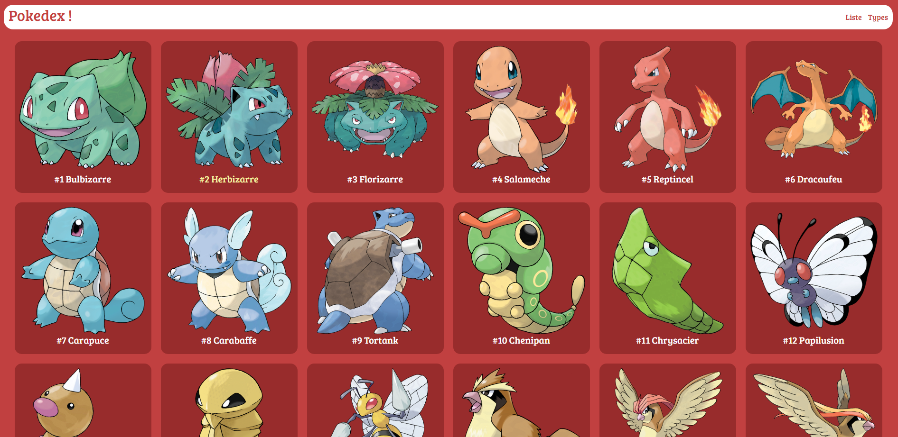
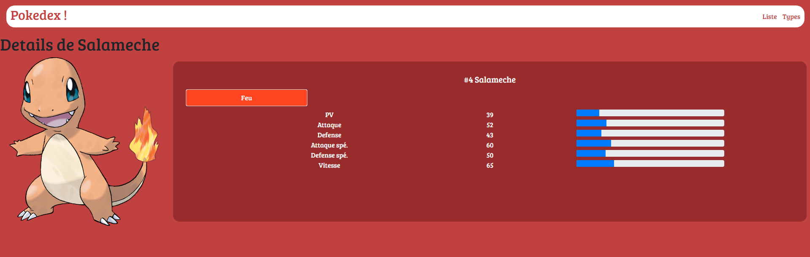
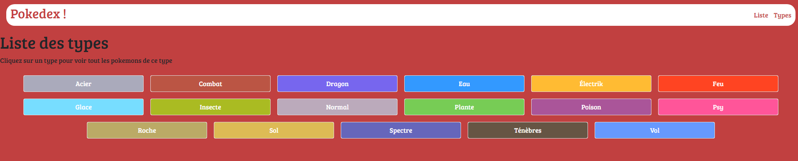
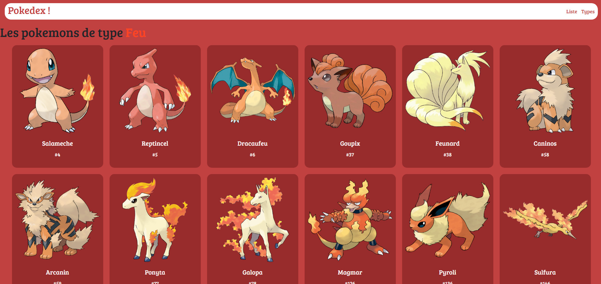

# Pokédex

## Atelier révision en autonomie - PHP

Durant cet exercice réalisé durant ma formation à O'Clock, nous avions comme consigne de réaliser un Pokedex (une sorte de dictionnaire de créatures Pokemon) afin d'appronfondir le modèle MVC, MySQL et PHP.

Pour cet exercice j'ai utilisé: 
- PHP 
- MySQL
- AltoRouter
- HTML & CSS (Bootstrap)
- Composer

La base de données des pokemons était déjà fournies avec leur nom, type etc...
L'application se compose donc de la page d'accueil: 

Chaque pokemon est cliquable et ramène sur sa fiche personnel avec les informations qui lui appartiennent (type, nombre de point de vie etc et une barre de statistique associée) : 

En haut du site, nous pouvons revenir sur l'accueil en cliquant sur liste, ou voir tous les types de pokemons: 

En cliquant sur un type, nous avons une liste de tous les pokemons appartenant à ce type, tous cliquable vers leur page personnelle: 

Pour avoir un aperçu de l'application, il suffit de l'a cloner et de vous rendre dans le dossier public.

